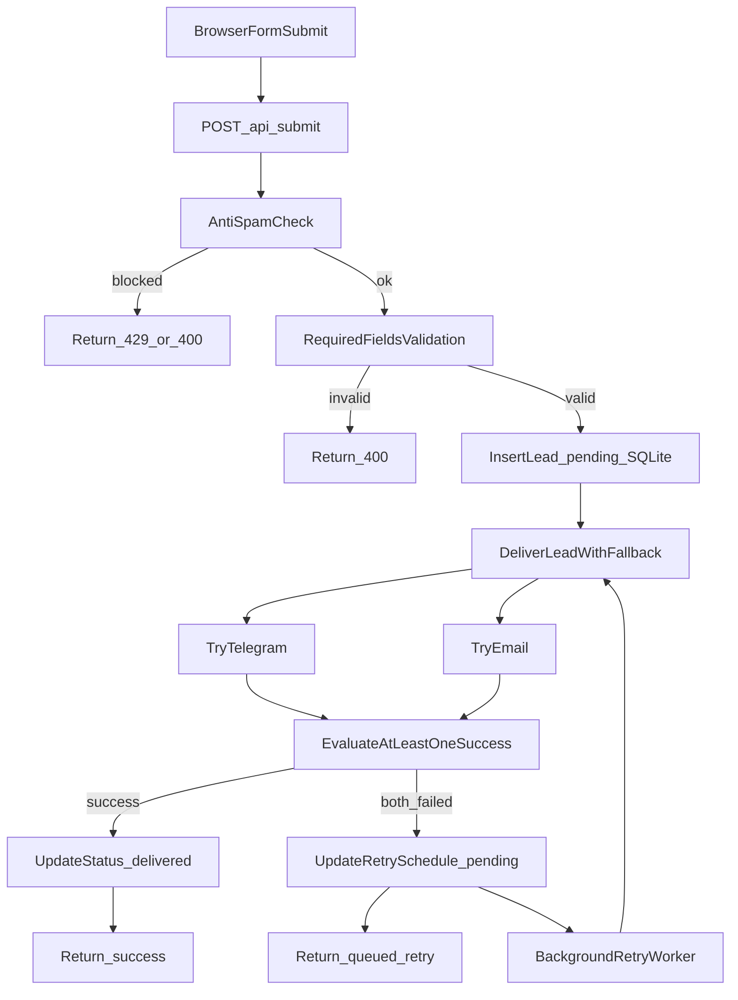

# Deep Audit: Grassigrosso (catalogue baseline)

Date: 2026-04-17  
Branch baseline: `catalogue`

## 1) Component Map and System Boundaries

### 1.1 Frontend layer (MPA)
- Pages (entry points): `index`, `hotels`, `dealers`, `catalog`, `catalogue-new`, `documents`, `contacts`, plus service pages (`privacy`, `terms`, `cookies`, `404`, `unsubscribe`) configured in `vite.config.mjs`.
- Shared runtime: `src/main.js` (численные метрики строки/слушателей/observer актуальны на дату аудита и не должны использоваться как текущий контракт).
- Shared styles: `src/style.css` -> `src/styles/tokens.css`, `src/styles/base.css`, `src/styles/components.css`.
- Critical first paint CSS injected via `grassigrosso-critical-preloader` plugin (`vite.config.mjs`) into ``.

### 1.2 Backend/API layer
- Single service: `server.cjs` (Express).
- Core endpoints:
  - `GET /health`
  - `POST /api/submit`
  - `GET /api/unsubscribe`
  - `GET /api/download/:docId`
  - Dev-only: `/api/test`, `/api/get-chat-id`, `/api/smtp-diag`.
- Responsibilities in one process:
  - anti-spam + validation
  - lead persistence
  - delivery orchestration (Telegram + SMTP)
  - retry worker
  - static/proxy server behavior.

### 1.3 Domain modules (`lib/*`)
- `lib/db.cjs`: SQLite access (`better-sqlite3`), WAL mode, lead states and retry schedule.
- `lib/anti-spam.cjs`: honeypot, rate-limit window, min interval, block period, field length guards.
- `lib/cors-config.cjs`: strict allowlist CORS strategy.
- `lib/confirmation-email.cjs`: confirmation email HTML + HMAC token generation/verification for unsubscribe links.

### 1.4 Infra and runtime
- Build/deploy:
  - `Dockerfile` (multi-stage build, production runtime image)
  - `docker-compose.yml` (volume-backed `/app/data`)
  - `nginx.conf` (proxy + canonical redirects + cache policy).
- Environment:
  - `.env.example` defines delivery channels, anti-spam, CORS, API URL, maps key, runtime port.

## 2) Critical Contracts (Invariants)

1. `page` field contract:
   - Produced in frontend (`getPageName()` and modal-specific hardcoded values in `src/main.js`).
   - Consumed in backend `PAGE_EMAIL_ROUTING` (`server.cjs`).
   - Any mismatch silently reroutes to fallback recipient (`MAIL_TO`).

2. Canonical URL policy in production:
   - Host redirect to `grassigrosso.com`.
   - `.html` suffix redirected to clean URL.
   - `getPageName()` assumes clean paths.

3. Delivery success semantics:
   - Lead is accepted if at least one channel succeeds.
   - If both fail, lead stays `pending` with retry schedule in SQLite.

4. Submission acceptance gates order:
   - Anti-spam check executes before required-field validation (`name/phone/email`).
   - A blocked IP receives 429 regardless of payload quality.

5. Production/static behavior:
   - In production, Node serves `dist` and fallback routes.
   - In development, non-API traffic proxies to Vite.

6. CMS constraints:
   - Strapi catalog integration is already implemented via backend endpoints (`/api/catalog/products`, `/api/catalog/hero-slides`).
   - Keep frontend decoupled from direct Strapi runtime env contract; form contract remains unchanged without dedicated task.

## 3) Runtime Verification Results (Smoke, snapshot on 2026-04-17)

Tests were run against isolated local prod-like runtime (`NODE_ENV=production`) with canonical `Host: grassigrosso.com`. This section is historical evidence for the audit date, not a guarantee of current runtime behavior.

### 3.1 Verified endpoint behavior
- `GET /health` returns:
  - `status: ok`
  - queue size
  - channel configuration booleans.
- `POST /api/submit` (valid payload with channels configured but unreachable):
  - returns `202`-style semantic payload (`delivery: queued_retry`, `queued: true`)
  - lead persisted and added to retry queue.
- `POST /api/submit` (missing required field):
  - returns `400` with `name, phone и email обязательны`.
- `POST /api/submit` (honeypot filled):
  - returns `429`, with `Retry-After`.
- `GET /api/unsubscribe` with invalid token:
  - returns `403`.
- `GET /api/unsubscribe` with valid HMAC:
  - returns `302` redirect to `/unsubscribe.html`.
- `POST /api/submit` with both channels disabled:
  - returns `500` with `Нет активных каналов доставки (email/telegram)`.

### 3.2 Verified queue/retry state
- SQLite rows in `data/leads-audit.db` moved into `pending` with populated:
  - `attempts`
  - `next_retry_at`
  - `last_error` JSON (`telegram` + `email` failures).
- Observed in server logs:
  - Telegram failures (`Not Found` for fake token/chat)
  - SMTP connection failures (`ECONNREFUSED`)
  - lead added into retry queue.

## 4) Delivery Pipeline Audit

### Guarantees confirmed
- Lead persistence happens before channel delivery attempt.
- Channel failures do not drop the lead.
- Retry schedule is persisted, not in-memory.

### Gaps confirmed
- No terminal cutoff policy from `pending` to `failed` in active flow (function exists but not used in pipeline).
- Retry can be effectively unbounded under persistent channel failure.

## 5) Security and Operational Risk Register

## High
- **Monolithic runtime coupling (`src/main.js`)**: high regression blast radius; page-specific changes can impact unrelated flows.
- **Contract drift risk (`getPageName` vs `PAGE_EMAIL_ROUTING`)**: easy to break silently during page expansion.
- **Single-process mixed concerns (`server.cjs`)**: API + delivery + static serving in one file complicates safe incremental changes.

## Medium
- **Anti-spam in-memory state** resets on restart; no cross-instance/shared memory.
- **Canonical host redirect can interfere with local/proxy checks** if Host header not aligned.
- **Build warnings for `noscript` in `<head>`** across pages (currently non-blocking but persistent hygiene issue).
- **Potentially infinite retry lifecycle** without dead-letter threshold.

## Low
- **Unsubscribe user link in confirmation email disabled** (`showUnsubscribeLink = false`) while backend route remains active.
- **No formal automated test suite**; heavy reliance on manual smoke and runtime logs.

## 6) Frontend Stability and Performance Findings

- `src/main.js` concentrates all concerns (animations, modals, forms, map, layout sync, media, cookie, etc.).
- Multiple runtime blocks are conditionally guarded by DOM presence (good), but global side effects remain dense.
- Preloader strategy is robust (font budget + hero media wait + fallback path), but broad scope implies high interaction risk when editing load pipeline.
- Frequent use of observers/listeners increases coupling and debugging complexity.

## 7) Build/Deploy Verification Findings

- `npm run build` passes.
- Vite emits parse warnings (`disallowed-content-in-noscript-in-head`) on multiple HTML pages; output still generated.
- `vite.config.mjs` includes all known pages in `rollupOptions.input`.
- Production behavior in `server.cjs` and `nginx.conf` is aligned with clean URL strategy and API proxying.

## 8) Regression Matrix for All `catalogue` Changes

Minimum set to run before any merge from `catalogue`:

1. Build integrity
   - `npm run build` must pass.
   - verify target page output exists in `dist`.

2. Core API health
   - `GET /health` returns `status: ok`.

3. Submission flow
   - one successful submit path (`200` or `queued_retry` semantics acceptable by environment).
   - one validation failure (`400`).
   - one anti-spam failure (`429`).

4. Routing contract
   - if `page` mapping changed: sync check between frontend and `PAGE_EMAIL_ROUTING`.

5. Modal scenarios touched by catalog work
   - catalog request modal submit
   - documents request modal submit + download trigger
   - help-documents modal submit
   - commercial-offer modal submit.

6. Production URL behavior
   - canonical host redirect
   - `.html` to clean URL redirect.

## 9) Release Checklist for Safe Work in `catalogue`

- Work in small slices (one behavior change per commit).
- Keep `getPageName` and `PAGE_EMAIL_ROUTING` synchronized when adding or renaming page contexts.
- Do not alter delivery semantics (persist-before-send + retry schedule) without explicit migration plan.
- Preserve template-required blocks for any new/edited marketing page (`vite-critical-css`, metrics block, main script entry).
- Re-run smoke matrix after each catalog-related UI change affecting forms/modals.
- For infra changes, validate both Node static serving and nginx path behavior.

## 10) Prioritized Backlog (Post-Audit)

1. Split `src/main.js` into feature modules with guarded init per page.
2. Add automated API smoke script (`health`, submit variants, unsubscribe valid/invalid).
3. Add explicit retry ceiling + dead-letter semantics for irrecoverable deliveries.
4. Introduce contract test for `getPageName` keys vs `PAGE_EMAIL_ROUTING`.
5. Resolve HTML `noscript` placement warnings across all pages.
