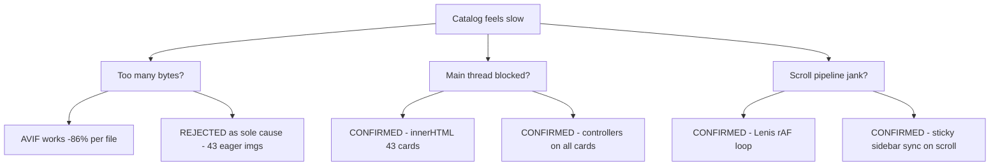

# Catalog perf debugging — design spec (Superpowers)

**Date:** 2026-06-01  
**Status:** diagnosis complete — root causes validated  
**Related:** [2026-06-01-catalog-media-optimization-design.md](./2026-06-01-catalog-media-optimization-design.md)

## Problem statement

После оптимизации медиа (AVIF, deferred slides, load queue) каталог `/catalog` **всё ещё тупит**: заметный лаг после загрузки, тяжёлый скролл, «подвисание» при фильтрах.

## Hypothesis tree (GSD scientific method)



## Validated measurements (local, 2026-06-01)

| Signal | Value | Interpretation |
|--------|-------|----------------|
| Visible cards | 6 | Pagination works |
| Cards in DOM | 43 | Full grid after Strapi |
| `loading="eager"` images | **43** | Bug: not scoped to visible |
| Eager on **hidden** cards | **37** | Browser fetches/decodes off-screen |
| `loading="lazy"` images | 0 | Lazy never used for slide 0 |
| `/uploads/` image requests | **46** | ~40+ despite "6 visible" |
| Deferred slides in DOM | 8 | Defer works for slides 1–4 |
| DOM nodes | ~2252 | Heavy tree |
| Products JSON | 55 KiB, ~34 ms | API not the bottleneck |
| Filters JSON | 3.7 KiB | OK |
| Headless time to 43 cards | **~21 s** | Dev cold path / Strapi + double React work |

## Root causes (priority order)

### P0 — Eager loading defeats media strategy

`buildSlideHtml` passes `eager: true` for **every** card's slide 0:

```187:187:src/catalog/catalog-product-gallery.ts
const slidesHtml = gallery.map((item, index) => buildSlideHtml(item, index, index === 0)).join('')
```

`loadPictureElement` queue (concurrency=2) **does not gate** native `` fetches. Result: **37 hidden cards still load AVIF**.

### P0 — Full grid replace jank spike

`loadCatalogueFromStrapi()` → `innerHTML` for 43 cards → destroy/re-init all galleries → `applySorting` + `applyFilters`. Single long main-thread burst; visible CLS/repaint.

### P1 — Gallery controllers on entire dataset

`initCatalogProductGalleries(cardsRootEl)` binds pointer/touch/scrub handlers on **all** multi-slide cards, including `display:none`. Duplicate pass in `catalog-page.js`.

### P1 — Scroll stack competition

- Lenis: perpetual `requestAnimationFrame` on desktop
- Sticky sidebar: layout reads every scroll + after every `applyFilters`
- Sidebar wheel capture: non-passive listeners

### P2 — Hero slide 0 double path

React renders `<picture>` for slide 0; `applyCatalogHeroFeed` replaces with plain `` — possible second decode if URL differs.

## What media optimization *did* fix

- File size: 243 KiB → 33 KiB per cover (−86%)
- Deferred slides 1–4: not in DOM until swipe
- Browser selects AVIF (0 PNG requests for cards)

## What it *did not* fix

- **Count** of images loaded on first paint path (~46, not 6)
- Main-thread DOM rebuild
- Per-card interaction overhead
- Smooth-scroll + sticky layout cost

## Recommended fix phases

See [../plans/2026-06-01-catalog-perf-fixes.md](../plans/2026-06-01-catalog-perf-fixes.md).

## Success criteria (post-fix)

1. Without scroll: ≤8 `/uploads/` image requests (6 visible + hero + margin)
2. No `loading="eager"` on hidden cards
3. Strapi hydrate long task <100 ms (or chunked)
4. INP on filter chip <200 ms
5. Scroll FPS stable on MacBook Air / mid Android
